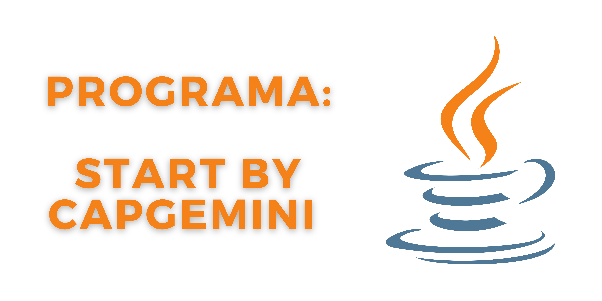

<h1 align="center">
    
</h1>

<h4 align="center">
    🚧 Programa: Start By Capgemini 🚀 em construção... 🚧
</h4>

## 💻 Sobre o programa

☕🤔 O programa da Capgemini visa qualificar profissionais de TI, desta forma, os módulos elaboradores foram divididos em: 
- Introdução a lógica de programação;
- Lógica de programação de algoritmos I;
- Lógica de programação de algoritmos II;
- Lógica de programação de algoritmos III;
- Trilha de especialização.
